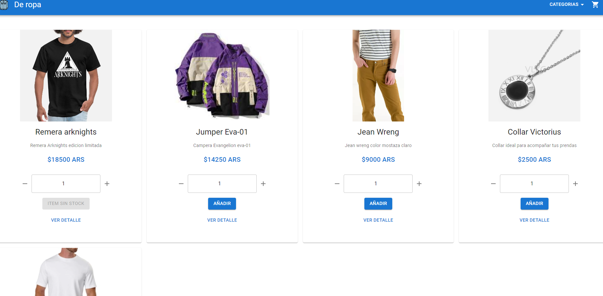
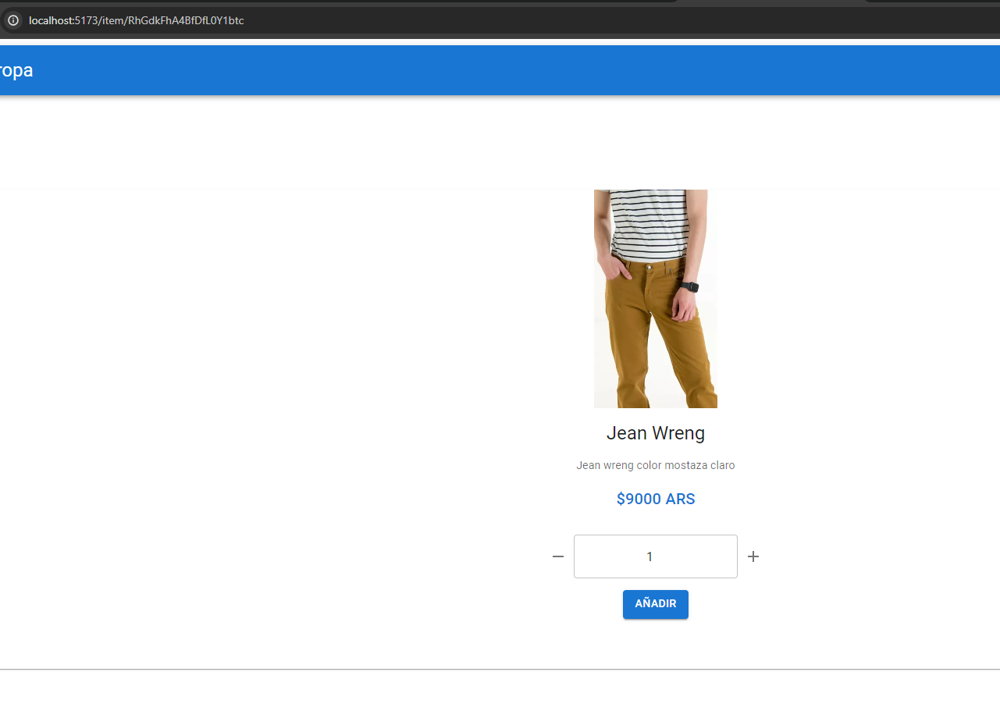
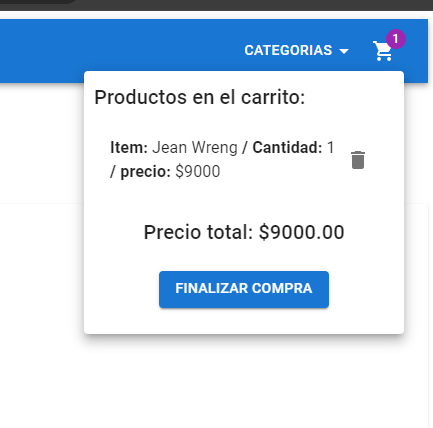
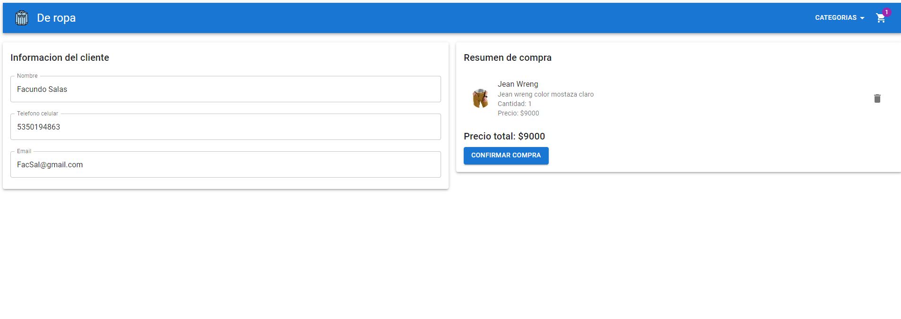
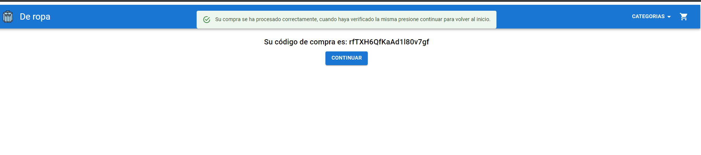

# React + Vite

This template provides a minimal setup to get React working in Vite with HMR and some ESLint rules.

Currently, two official plugins are available:

- [@vitejs/plugin-react](https://github.com/vitejs/vite-plugin-react/blob/main/packages/plugin-react/README.md) uses [Babel](https://babeljs.io/) for Fast Refresh
- [@vitejs/plugin-react-swc](https://github.com/vitejs/vite-plugin-react-swc) uses [SWC](https://swc.rs/) for Fast Refresh

# uso 

instalar paquetes con npm i 

correr con npm run dev

# Navegacion y uso

Home

Agregar un articulo al carrito

Dar a finalizar compra

rellenar el formulario y finalizar la compra dando a confirmar compra

una vez confirmada la compra obtiene el id luego al dar a continuar vuelve al home con los datos limpios

